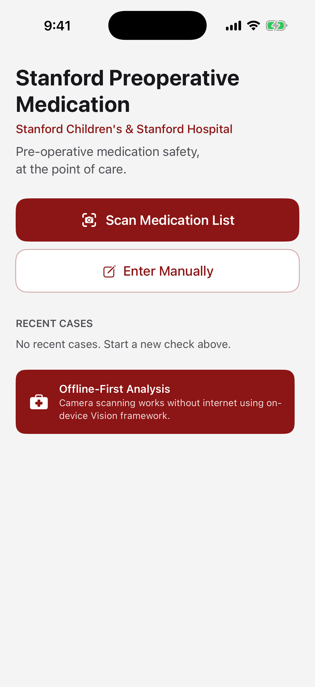

# PreOpCheck

iOS app that scans medication labels and checks them against a pre-op drug database. Built targeting Stanford hospital implementation, on TestFlight.

## What it does

A clinician points the phone at a printed medication list, or types drug names by hand, and gets a per-drug instruction: take as directed, hold for a set number of hours or days, hold the day of surgery, or consult a named service. Where the guideline branches on indication, dose, or route, the app asks instead of guessing. Results can be saved as a case and reviewed later.

The guidance is the PARC Pre-Operative Medication Guidelines from Stanford Children's Health, Pediatric Anesthesia & Pain Medicine. It is pediatric. Adult protocols may differ, and the app says so.

## How it works

```
Camera frames ──▶ Vision OCR ──▶ section exclusion ──▶ DrugMatcher ──▶ ResolvedMedication
                                                            ▲                   │
Manual entry ────────────── MedicationResolver ─────────────┘                   ▼
                                                                          ResultsView
                                                                     (PARC guidance, asks
                                                                      conditionals, saves case)
```

### SwiftUI

The app is SwiftUI throughout: `HomeView`, `EntryView`, `ResultsView`, `PrivacyNotice`. The one exception is the live camera, which is a `UIViewControllerRepresentable` wrapping an `AVCaptureSession` because SwiftUI has no native camera preview. `CaseStore` is an `ObservableObject` injected at the root.

### OCR

`ScannerView` runs `VNRecognizeTextRequest` from Apple's Vision framework on live frames. Recognition is set to accurate with language correction off, since autocorrect mangles drug names. A guide rectangle on screen becomes a region of interest so only the framed part of the page is read. Frames are throttled and stamped with a generation counter so a slow result from an old frame cannot overwrite a newer one.

Recognized text goes to `DrugMatcher`, which resolves every hit to a canonical drug id before anything else happens. The index holds generics, brands, and multi-word n-grams. Fuzzy matching is bounded by edit distance, blocked by the first two letters, and switched off for short tokens, which is where false positives came from. Longest span wins, so "diclofenac XR" beats "diclofenac". Manual entry goes through the same matcher, so typing and scanning a drug produce identical results.

### Offline-first database

The guideline lives in `MedicationDatabase.swift` as Swift structs, compiled into the binary. There is no network layer in the app. Each `Drug` carries a `Guidance` with an `Action`, optional `Conditional` branches, and pediatric cardiac notes. `GuidelineMeta.revision` is stamped on every saved case, and a case saved under an older revision is marked stale rather than silently re-interpreted.

Saved cases store only drug ids, the text that was matched, the branch the clinician chose, and the resulting action. Bounding boxes and match confidence are scan-time artifacts and are dropped. Persistence is `UserDefaults`.

### Privacy and PHI handling

The app is designed so that protected health information never exists outside a single function call.

- The camera is never recording. Frames are analyzed and discarded. Nothing is written to the camera roll or to disk.
- Non-medication text is not retained. OCR results are matched against the drug index inside the recognition handler, and only matches leave it. Patient names, dates of birth, and record numbers on the page are never stored.
- Section exclusion. Headings like "Allergies", "Adverse reactions", or "Discontinued" close the medication section, and anything below them is ignored, so an allergy list is not read as an active medication.
- Common header words ("patient", "dob", "mrn", "ssn") are stop words in the matcher.
- Nothing leaves the device. There is no server and the app works with no connection.
- A privacy notice explains all of this on first use of the scanner and can be shown to a patient on request.

This is a design description, not a compliance claim. Deployment inside a hospital still goes through that institution's review.

## Tech stack

- Swift, SwiftUI, Combine
- AVFoundation for capture, Vision for text recognition
- No third-party dependencies
- iOS 26.4 deployment target, Xcode 26

## Setup

```bash
git clone https://github.com/TimothyChennn/preopcheck.git
cd preopcheck
open PreOpCheck.xcodeproj
```

Select the `PreOpCheck` scheme and run. The scanner needs a physical device with a camera. In the simulator, use manual entry.

Distribution is through TestFlight. Set your own team under Signing & Capabilities before archiving.

## Screenshots

Home screen in the iOS Simulator (iPhone 17):



<!-- Add a device capture of the scanner and results screens when convenient. -->

## Project layout

| File | Role |
|---|---|
| `PreOpCheckApp.swift`, `ContentView.swift` | App entry and root navigation |
| `HomeView.swift` | Scan, manual entry, recent cases |
| `ScannerView.swift`, `CameraWrapperView.swift` | Live camera, Vision OCR, section exclusion, permission gate |
| `EntryView.swift` | Typed or pasted medication entry |
| `DrugMatcher.swift` | Canonical id resolution, n-gram and bounded fuzzy matching |
| `MedicationResolver.swift` | Single conversion point from text to resolved medications |
| `MedicationDatabase.swift` | PARC guideline as data, actions, conditionals |
| `ResultsView.swift` | Per-drug guidance, conditional questions, save case |
| `CaseStore.swift` | Saved cases in UserDefaults, revision staleness |
| `PrivacyNotice.swift` | First-run and on-demand privacy explainer |
| `Theme.swift` | Colors and typography |

## Known limitations

- Section exclusion assumes allergies appear below the medication list, which matches every EHR printout seen so far. A layout with allergies above medications would drop the medications.
- The guideline is pediatric only.
- Tests cover the matcher only (`DrugMatcherTests.swift`). The resolver, section exclusion and results bucketing are not tested yet.
